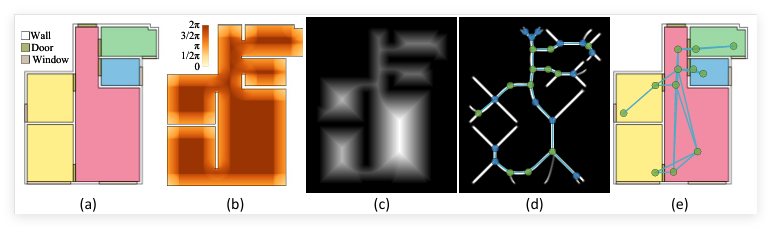
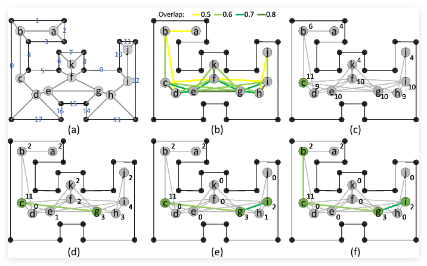

# 编译
项目在 VS2019 + Windows C++ 17 下进行编译

## 环境配置

### CMake 3.27.0

### Boost 1.71.0
- [Boost 1.71.0 官方历史版本页面](https://www.boost.org/users/history/version_1_71_0.html)  
- [Boost 配置教程（只进行到第三步）](https://blog.csdn.net/nanke_yh/article/details/124346308)

### OpenCV 4.1.2
- [OpenCV GitHub Releases](https://github.com/opencv/opencv/tags)  
- [OpenCV 配置教程](https://blog.csdn.net/m0_70885101/article/details/141251001)

### gdal 与 googletest 已放入项目中 

### 设置环境变量
- gdal 写出 dxf 需要读取 `header.dxf` 和 `trailer.dxf`  
- 在 Windows 中设置 `GDAL_DATA` 指向这两个文件的目录

---

## 基于启发式算法的扫描站点规划

  

我们通过引入一种基于可见性场（VF）概念的新型启发式方法来应对静态 LiDAR 应用中的挑战。**VF** 捕捉了 LiDAR 特有的可见性特征，包括范围和入射角度的限制，从而显著降低了计算复杂性。通过聚焦于 VF 中的关键点（如中轴线和连接点），我们有效地将优化空间从二维简化到一维，促进了最小化、完全连接的视点网络的构建，实现了全面覆盖并减少了冗余。

流程如下：
1. 根据输入的平面图获取**BSP树**
2. **静态 LiDAR** 获取热力值图
3. 获取 **骨架线** 以及骨架上的点
4. 通过 **启发式算法** 进行优化

  

---

### 输入：
- **房间平面图**：项目支持从 **DXF** 文件读取房间平面图信息。要求平面图必须是**闭合的**，以确保数据的完整性和准确性。

### 输出：
- **站点信息**：基于输入的房间平面图数据，系统会生成对应的站点信息，包含优化后的视点网络和站点布局。

## 测试框架

使用 **googletest** 对以下模块进行测试：
- 读入读出功能
- BSP 树构建
- 骨架线提取
- 热力图获取
